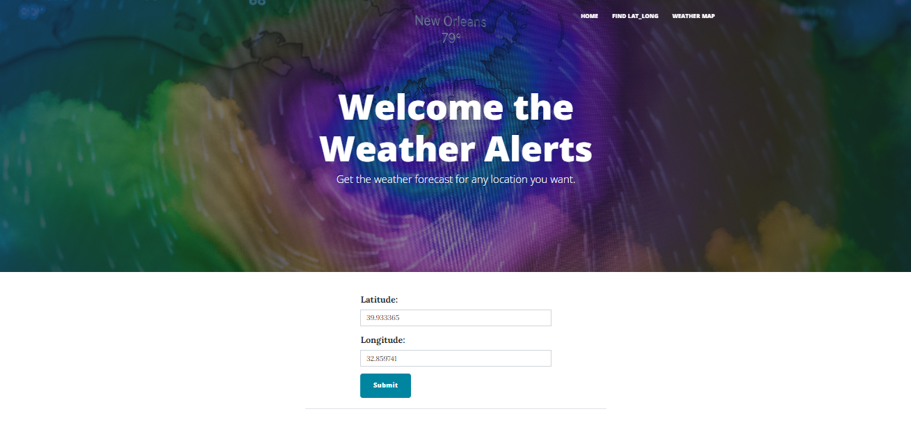
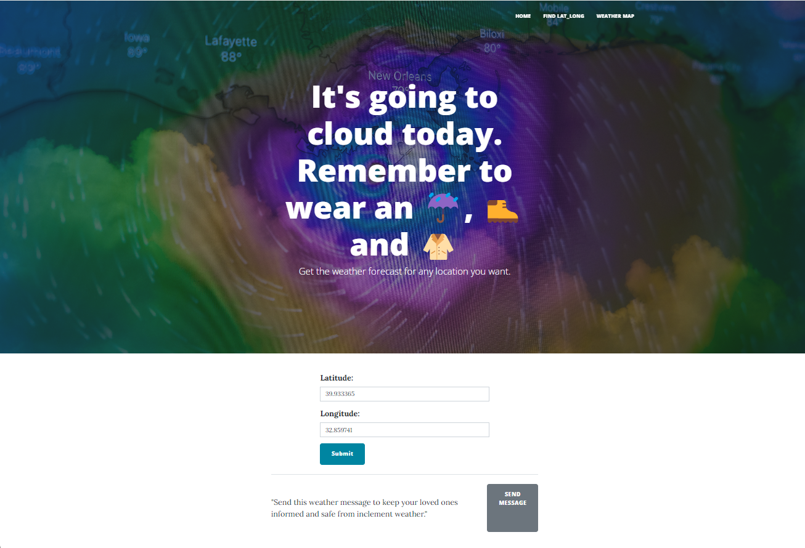
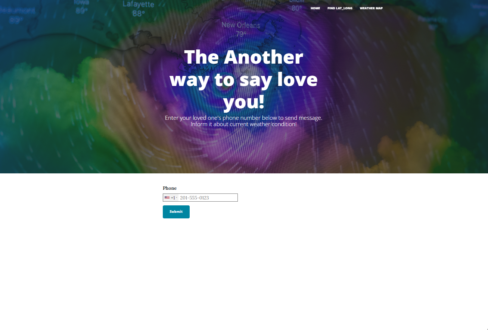

# Weather Alerts
Weather Alerts is a Flask web application that integrate a [Weather API](https://openweathermap.org/api) based on user-provided lat-long and display weather information from this location. The user can send a message containing the weather information to any number via a [web API](https://www.twilio.com/en-us).

This project utilizes Flask for the web framework, OpenWeather to access current weather data, and Twilio to send message.

## Features
- **Current Weather Information:** Gets current weather information for a specific location via Open Weather API.
- **Twilio Integration:** Sends the weather information to whoever you want as a text message.
- **Pagination:** Displays the song list with pagination to navigate through the results.
- **User Interaction:** Allows users to input a date to retrieve songs from that specific time.

## Technology Used:
 - Flask
 - Flask-WTF
 - Flask-Bootstrap
 - Flask-Paginate
 - Beautiful Soup
 - Requests
 - Spotipy

   ## Getting Started
  - **Fork the repository:** You should **fork the repository** and then **clone it** so you can manage your own repo and use this only as a template.
    ```
    $ git clone https://github.com/your_username/your-flask-project.git
    ```
  - **Install dependencies:**
  
    ```
    pip install -r requirements.txt
    ```
  - **Set Environment Variables:** Ensure you have your own credentials such as:
    -  'OWN_API_KEY'  for OpenWeather API.
     - 'OWN_ACCOUNT_SID' and 'OWN_AUTH_TOKEN' for Twilio API.
     - 'SECRET_KEY' for Flask.
    
  - **Run the Application:**
  
      ```
       python main.py
      ```
  
  - **Access the Application:** Open your web browser and navigate to http://localhost:5000 to access the application.

## Screenshots
 - Home Page:    
   <div align="center"></div>

 - The Current weather information on the entered location:    
   <div align="center"></div>

  - Send a text message to keep your loved ones informed about the weather information:    
   <div align="center"></div> 

## Contributing
   Contributions are welcome! Please fork the repository and create a pull request with your changes.
